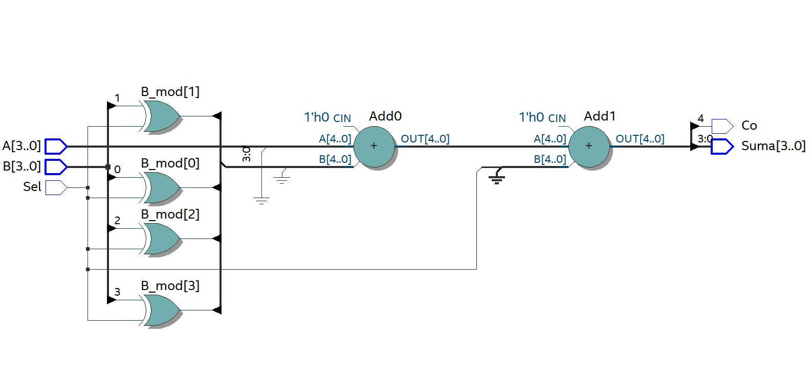
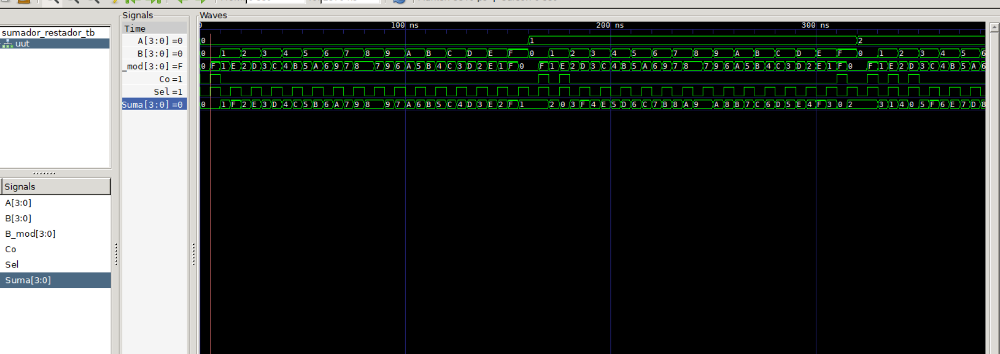
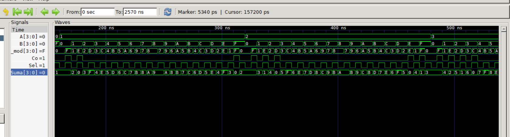
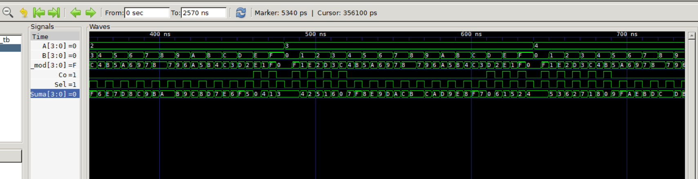
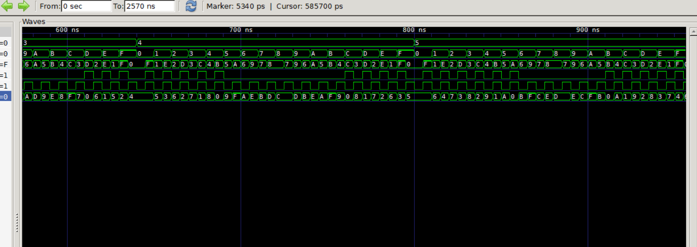
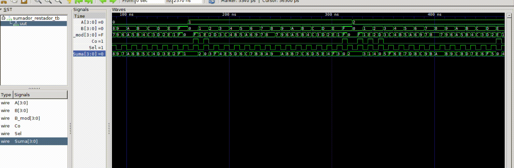

# Lab02 - Sumador/Restador de 4 bits

# Integrantes

[Samuel Sierra](https://github.com/samuel-sierra-tique)

[Julieth Gómez](https://github.com/Juliethg24)

# Informe

Indice:

1. [Documentación](#documentación-de-los-circuitos-implementados-implementado)
2. [Simulaciones](#simulaciones)
3. [Evidencias de implementación](#evidencias-de-implementación)
4. [Preguntas](#preguntas)
5. [Conclusiones](#conclusiones)
6. [Referencias](#referencias)

## Documentación del diseño implementado

### 1. Sumador/Restador

#### 1.1 Descripción

1. El Sumador:

Toma dos números binarios de 4 bits y calcula su suma matemática. Además, maneja los "acarreos" (lo que "llevamos" cuando una suma excede la base, igual que cuando sumas 7 + 5 en decimal y "llevas" 1).

* ¿Cómo funciona?
El circuito de nuestro diagrama está formado por cuatro bloques llamados Sumadores Completos (Full Adders) de 1 bit, conectados en cascada.

* Cada uno de esos bloques internos hace lo siguiente para una sola columna de bits:

* Suma el bit de A, el bit de B y un bit de acarreo de entrada (Cin).

* Produce un bit de resultado de la suma (So).

* Si la suma de esos tres bits es 2 o 3 (en binario 10 o 11), genera un acarreo de salida (Cout o Co) que vale 1.

* Ese acarreo de salida se conecta a la entrada de acarreo del siguiente sumador a su izquierda (por ejemplo, el acarreo C0 pasa al sumador de la columna 1). A esto se le llama Sumador de Propagación de Acarreo (Ripple Carry Adder), porque el acarreo "viaja" desde el bit menos significativo hasta el más significativo.

2. El Restador:

Calcula la diferencia entre dos números (A - B). En lugar de diseñar un circuito completamente nuevo y complejo para restar, los ingenieros utilizan un truco matemático muy elegante: convertir la resta en una suma utilizando números negativos.

* ¿Cómo funciona?
Recordemos que restar es básicamente sumar un número negativo, y en nuestro circuito logramos esto usando el método de complemento a 2. Cuando quiero hacer una resta, pongo la señal de selección (Sel) en 1; esto hace que las compuertas XOR actúen como inversores, volteando todos los bits del número B para darnos el primer paso, que es el complemento a 1. Luego, la regla matemática dice que debo sumarle un 1 a ese resultado para obtener el número negativo real, y el diseño lo resuelve de forma muy astuta introduciendo esa misma señal Sel de 1 directamente como el acarreo inicial del primer sumador. De esta manera, el bloque principal simplemente hace su trabajo normal y suma el número A, los bits invertidos de B y ese 1 extra del acarreo, realizando la resta exacta con un solo circuito.

#### 1.2 Diagramas

## Simulaciones 

### 2. Simulación del sumador/restador

#### 2.1 Descripción

1. Comportamiento del Sumador (Sel = 0)
En las gráficas de simulación, el funcionamiento del sumador puro se evidencia en todos los intervalos donde la señal de control Sel se encuentra en un nivel bajo (0). Durante estos momentos, se puede observar que la señal intermedia B_mod es exactamente idéntica a la entrada B, lo que confirma que las compuertas XOR están dejando pasar los datos sin ninguna alteración. El sistema procede a sumar el valor hexadecimal de A con el valor de B de forma directa. Por ejemplo, al mirar las formas de onda, si A tiene un valor de 1 y B tiene un valor de 2, cuando Sel es 0, la señal de salida Suma refleja correctamente un 3. En este modo de suma, el bit de acarreo final (Co) se enciende poniéndose en 1 únicamente cuando el resultado de sumar A y B excede la capacidad máxima de los 4 bits, es decir, cuando la suma es mayor a F en hexadecimal.

2. Comportamiento del Restador (Sel = 1)
El circuito cambia a modo restador cada vez que la señal Sel se eleva a 1. En las ondas de simulación, esto se nota inmediatamente porque la señal B_mod deja de ser igual a B y pasa a mostrar sus bits completamente invertidos, evidenciando el primer paso del complemento a 2. Al mismo tiempo, ese 1 de la señal Sel entra como acarreo inicial completando la conversión matemática. De esta manera, el circuito calcula A menos B. Por ejemplo, se observa que si A vale 0 y B vale 1, con Sel en 1, el resultado en la señal Suma es F, que corresponde a -1 expresado en complemento a 2. En este modo, el comportamiento del bit Co cambia de significado y actúa como un indicador de signo: se puede ver en la simulación que Co es 1 cuando el resultado es positivo o cero (como cuando A es 2 y B es 1, dando Suma 1), y Co se vuelve 0 cuando el resultado es negativo (como cuando A es menor que B), confirmando que la respuesta está en formato negativo de complemento a 2.

#### 2.2 Diagrama

## Evidencias de implementación

## Conclusiones

* Optimización de recursos físicos: La principal ventaja de esta arquitectura es la reutilización de componentes. Al aplicar la aritmética de complemento a 2, evitamos tener que diseñar y construir un circuito restador completamente independiente, lo que ahorra compuertas lógicas, espacio y energía en la FPGA.

* Eficacia del complemento a 2: Este método matemático demuestra ser la forma más eficiente de manejar números negativos en sistemas digitales. Permite transformar una operación de resta en una suma directa mediante la ecuación matemática A - B = A + ( B + 1), simplificando enormemente la lógica del hardware.

* Diseño de control elegante: La señal de selección (Sel) demuestra cómo un solo bit de control puede gobernar múltiples etapas de un circuito simultáneamente. Al actuar como interruptor para las compuertas XOR (generando el complemento a 1) y al mismo tiempo como el acarreo inicial (sumando el 1 restante), logra cambiar todo el comportamiento del sistema con una eficiencia notable.

* Doble función del acarreo de salida: La simulación permite concluir que el bit de acarreo final (Co) tiene interpretaciones distintas según la operación. En la suma, actúa como un indicador de desbordamiento (cuando el resultado supera los 4 bits); en la resta, se convierte en un indicador crucial para determinar el signo del resultado (1 para positivo, 0 para negativo en complemento a 2).

## Referencias

[1] M. M. Mano y M. D. Ciletti, Diseño Digital: Con una introducción a Verilog HDL, 5.ª ed. Pearson Educación, 2013.

[2] D. M. Harris y S. L. Harris, Diseño Digital y Arquitectura de Computadoras, 1.ª ed. Morgan Kaufmann, 2012.

[3] T. L. Floyd, Fundamentos de Sistemas Digitales, 11.ª ed. Pearson Educación, 2016.

[4] R. J. Tocci, N. S. Widmer, y G. L. Moss, Sistemas Digitales: Principios y Aplicaciones, 11.ª ed. Pearson, 2017.
